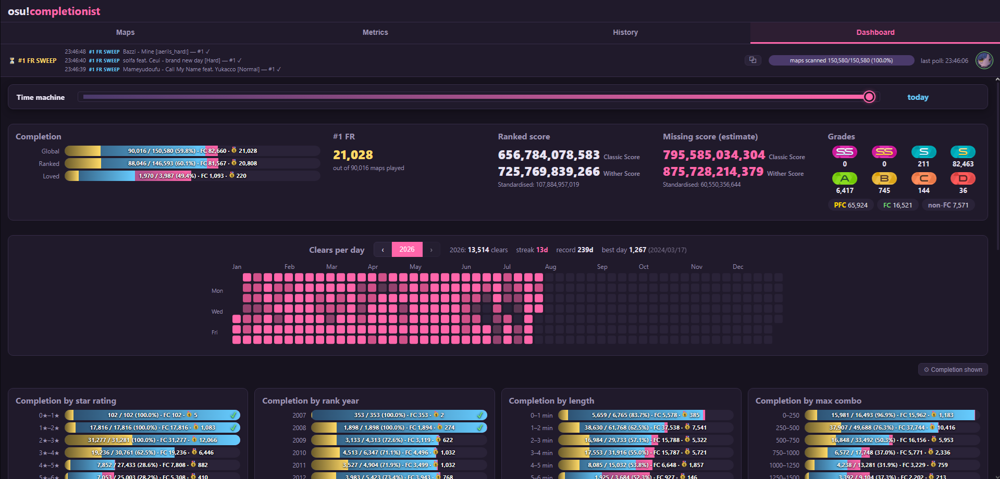
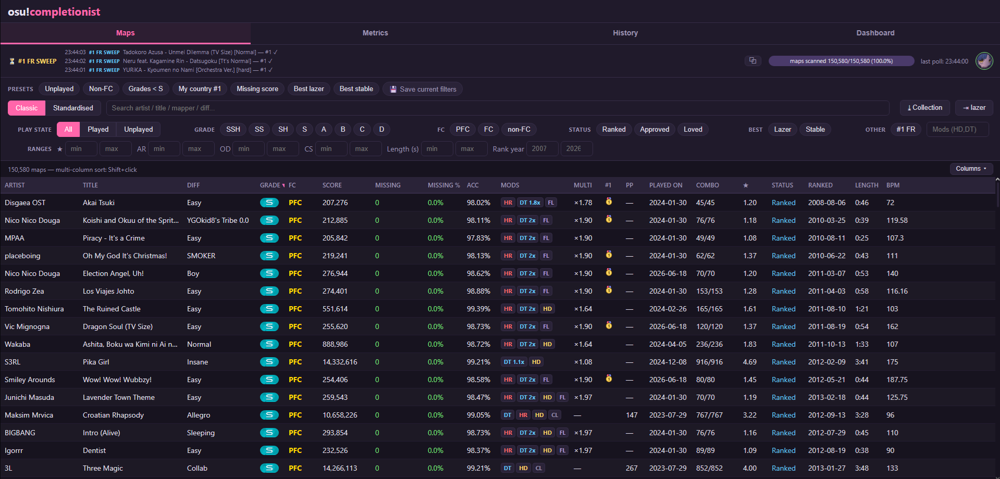
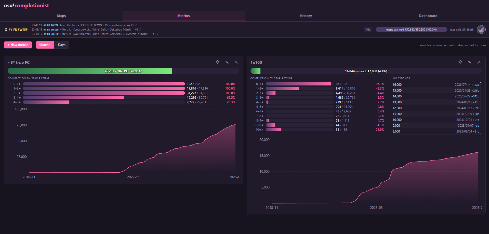
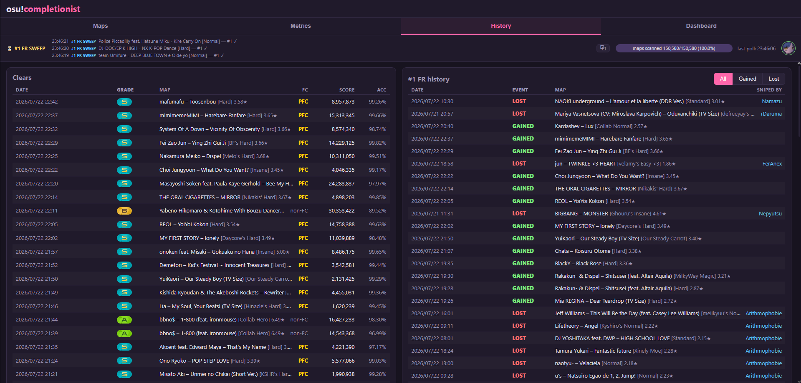

# osu! Completionist Tracker

Local, single-user web app that tracks your best score on **every ranked/approved/loved difficulty** of osu! standard — with advanced sorting/filters, a completion dashboard, custom metrics with milestones and evolution charts, country #1 tracking, a stream overlay for OBS, and near real-time pickup of new scores.



<details>
<summary>More screenshots — maps table, custom metrics, history</summary>







</details>

## Features

- **Maps table**: your best on all ~150k std ranked/approved/loved diffs, SQL-side sort/filters (grade, FC state, star rating, AR/OD/CS/HP, length, rank year, mods, free text…), presets, virtualized rendering.
- **Realistic missing score**: an auto-calibrated skill curve (median of your bests per 0.1★, isotonic regression) predicts what *you* can realistically score on each map — not the theoretical max.
- **Custom metrics**: build your own counters (e.g. "FCs with HD on 4★+ maps from 2015"), each with progress bar, per-star-rating completion, milestone dates and an evolution chart. Defaults: Clears, Full combos, Ranked score.
- **Country #1 tracking**: which of your scores are #1 on your country's leaderboard, gained/lost history with sniper names, automatic re-checks. (Requires osu!supporter + connecting your account.)
- **Dashboard**: completion by status/star rating/year, grade and FC distributions, skill curve, score sums (lazer / classic / optional witherscore).
- **History**: full clear log and country #1 event log side by side.
- **Collection export**: turn any filter (including a metric's missing maps) into an osu! collection — download the `.db`, or import it directly into osu!lazer with one click (optional, via [LazerCollectionImporter](https://github.com/ZaB0oo/LazerCollectionImporter) and `LAZER_IMPORTER_PATH`; note that lazer itself ignores drag & drop of collection files).
- **Heatmap & streaks**: GitHub-style clears-per-day calendar with current/record streaks and best day.
- **Time machine**: a date slider on the dashboard replaying your account state (clears, FCs, ranked score, country #1s) at any past day — instant, fully client-side.
- **Stream overlay**: transparent browser source for OBS with live session gains.
- **Polite syncing**: 60 req/min max against the osu! API, resumable backfill, automatic daily catch-up of newly ranked/loved maps.

## Prerequisites

- **Node.js ≥ 22.13** (the DB uses `node:sqlite`, built into Node: no native compilation). Check with `node --version`.
- An osu! OAuth application: https://osu.ppy.sh/home/account/edit#oauth — set the callback URL to `http://localhost:3727/api/auth/callback`.

## Setup

```bash
npm install
copy .env.example .env      # then edit .env: client id/secret + your user id
npm run dev                 # API server (:3727) + UI (http://localhost:5173)
```

Local "production" build (single URL, http://localhost:3727):

```bash
npm run build
npm start
```

On Windows you can just double-click `start-tracker.bat` (builds on first run, then starts the server and opens the browser).

OAuth credentials can also be entered later in the UI (settings menu) — they are stored in the local DB and take priority over `.env`.

## First launch — initial sync

In the UI, click **"Start initial sync"** (or `curl -X POST http://localhost:3727/api/sync/start`). Three phases, all visible in the status bar:

1. **Catalog**: full enumeration of ranked/approved/loved std maps via `/beatmapsets/search`. The osu!web search caps at ~10,000 results per query, so enumeration is **split by rank year**. Cursors are persisted per slice (resumable). Expect ~30–60 min. **DMCA/delisted maps** (removed from search but still ranked) are invisible to enumeration: once it finishes, the app automatically imports, by direct lookup, every set from the shipped `server/db/seed-sets.json` reference list (~39k known sets, delisted included) that is still missing — a fresh install converges to the full catalog on its own. Manual tools also exist: `POST /api/sync/verify-year/<year>` and `POST /api/sync/import-set/<id>`; maintainers can regenerate the reference list from a complete DB with `npm run export-seed`.
2. **Enrichment**: `GET /beatmaps?ids[]=` in batches of 50 for **max_combo** and up-to-date star ratings. ~50 min for the whole game.
3. **Backfill**: `GET /beatmaps/{id}/scores/users/{id}/all` for every diff. **~40 h at 60 req/min** for ~150k diffs. Resumable at any time (pause/resume in the UI, or just kill the process: only unchecked maps are redone). Maps with no score are marked "never played".

While all this runs, **polling** is already active: every 2 min (configurable), your scores from the last 24 h are fetched at top priority.

## New ranked/loved maps

Automatic, three mechanisms:

1. **Daily delta**: ~once a day, a scan of `/beatmapsets/search` sorted by rank date stops as soon as a full page is already known — a handful of requests per day. New diffs are enriched then backfilled immediately. Manual trigger: `POST /api/sync/delta-now`.
2. **Via polling**: if you play a map missing from the catalog (just ranked), it is fetched at high priority and added along with your score.
3. **Status changes** (e.g. graveyard → loved) are picked up by the delta and by the "Full catalog re-scan" (Maintenance menu), which also refreshes star ratings and DMCA flags.

## Country #1 tracking

Connect your osu! account from the sync bar (**supporter required** — country leaderboards are a supporter feature). The app then:

- sweeps the country leaderboard of every played map (resumable, ~several hours for large libraries);
- re-checks each new score immediately after you set it;
- re-checks held #1s periodically (default every 48 h, configurable) to detect snipes, and logs gained/lost events with the sniper's name.

The country is whatever your osu! profile says.

## Rate limiting (osu!api terms of use)

Single global queue: **60 req/min max, smoothed** (1 req/s), polling prioritized over backfill, exponential backoff on 429 (honoring `Retry-After`) and 5xx. The API's hard cap is 1200/min but we deliberately stay on the "polite" limit. Configurable via `API_RPM` (don't raise it without asking peppy).

## Score model — what is stored and why

Every score is stored with **both systems** (modern `x-api-version` header):

- `total_score`: lazer standardised (~1M × mod multiplier + bonus).
- `classic_total_score`: lazer's "classic" display. Classic is a **monotone** transform of standardised on a given map, so best classic = best standardised (one best pointer for both).
- `legacy_total_score`: ScoreV1 conversion of stable scores (NULL for native lazer scores).
- UI toggle "Classic / Standardised" (classic by default).
- Mod multipliers were rebalanced in **June 2026** and **every score recomputed server-side by osu!**, stable imports included: values returned by the API are already up to date. We never recompute a multiplier ourselves. Raw API payloads are kept (`raw`); `POST /api/sync/recompute` recomputes bests/FC states after a local logic change.

### FC states (FC column)

- **PFC**: perfect combo — `legacy_perfect` for stable scores, `is_perfect_combo` for lazer, fallback combo == map max_combo.
- **FC**: no miss and no break. For a **stable** no-miss score: dropping a slider end gives a 100 and removes exactly 1 combo, so FC iff `map_max_combo − score_combo ≤ number_of_100s`. Beyond that, certain slider break ⇒ non-FC. For a **lazer** no-miss score without `large_tick_miss`: FC.
- **non-FC**: `miss` > 0, `large_tick_miss` > 0, or missing combo unexplainable by slider ends (rule above).

### Grades

D → SSH, with **silvers** (SH/SSH = HD/FL) counted separately. The API returns X/XH, the UI displays SS/SSH.

## Missing score — documented approximation

- **"Missing" column** — depends on the display mode:
  - **Classic**: official lazer formula `classic = (n_objects² × 32.57 + 100000) × standardised / 1,000,000` (n_objects = circles + sliders + spinners) → theoretical max per map = `n_objects² × 32.57 + 100000`. Missing = skill-curve prediction minus your best, floored at 0.
  - **Standardised**: same, in standardised units. Spinner bonus ignored (< 0.1%).
  - Unplayed map = full prediction missing. The displayed % is relative to the map's prediction.
- **Witherscore** (optional, Advanced settings): implements the community proposal [ppy/osu#38224](https://github.com/ppy/osu/discussions/38224) as an alternative ranked-score display.

## Project structure

```
server/
  config.ts            # .env, API constants
  db/schema.sql        # beatmapsets, beatmaps, scores, beatmap_user, metrics, sync_state
  db/db.ts             # node:sqlite + migrations + transactions
  osu/rateLimiter.ts   # 60/min queue with 2 priorities + backoff (tested)
  osu/api.ts           # OAuth (client credentials + user auth code) + typed endpoints
  logic/score.ts       # FC states / grades / bests (tested)
  logic/scoreSql.ts    # shared SQL expressions + skill curve
  logic/metrics.ts     # custom metric conditions compiled to SQL
  logic/metricEval.ts  # metric evaluation + versioned cache
  logic/repo.ts        # score upserts + best pointers
  sync/catalog.ts      # API catalog enumeration + enrichment
  sync/daemon.ts       # pipeline, resumable backfill, polling, country sweeps
  routes.ts            # router aggregator
  routes/*.ts          # one module per domain (table, stats, metrics, sync…)
web/                   # React + Vite + TanStack Query/Table/Virtual
```

Database: `./data/tracker.db` (SQLite, WAL mode). Delete the file to start from scratch. One-click backup: settings menu → "Export database".

## Tests

```bash
npm test    # rate limiter + FC/best logic
```

## Known limits

- Legacy (ScoreV1) max score is not computed — it depends on map geometry and would require parsing `.osu` files.
- Polling only sees the **last 24 hours** (limit of the `recent` endpoint) and ignores fails. If the app was off longer while you played, use "Poll now" + optionally a re-backfill.
- Country leaderboards require **osu!supporter**; without a connected account, country #1 features stay dormant.
- `node:sqlite` prints an `ExperimentalWarning` at startup: harmless.
- One ruleset (osu! standard) for now; the schema is ready for the others (`ruleset` everywhere).

## Credits

This project was **entirely coded by AI** — [Claude](https://claude.com) (Anthropic), directed and tested by [ZaB0oo](https://github.com/ZaB0oo): every feature, fix and design decision was specified, reviewed and validated against a real completionist database (~90k played maps, ~150k tracked).
