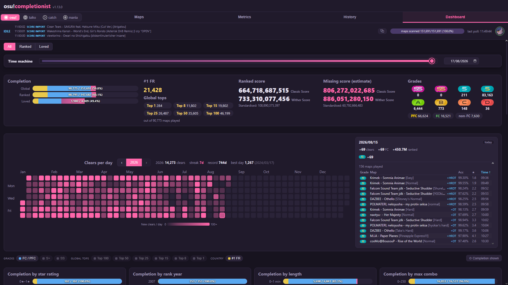
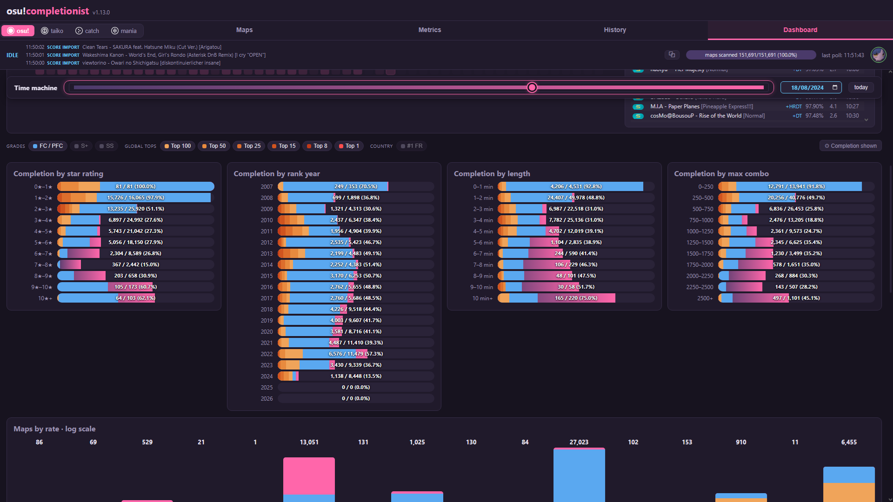
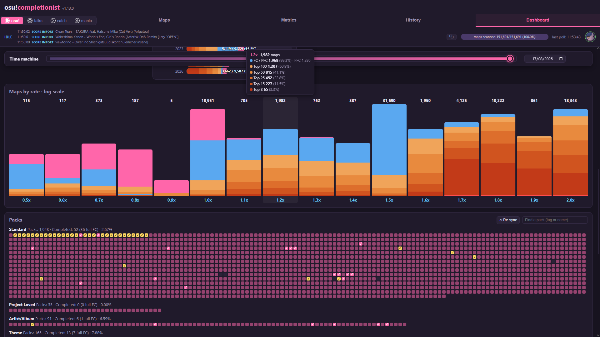
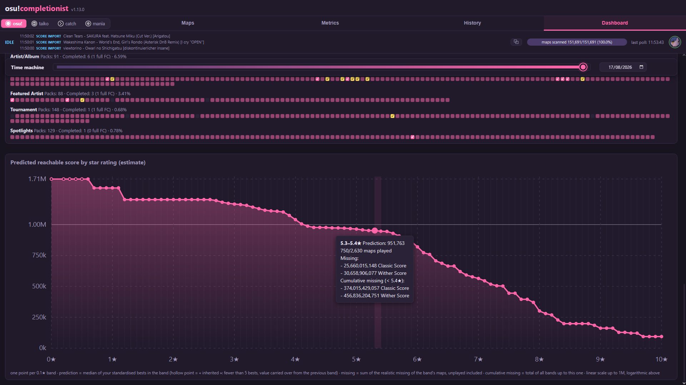
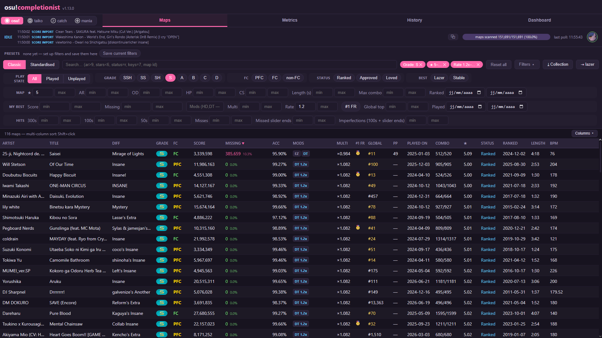
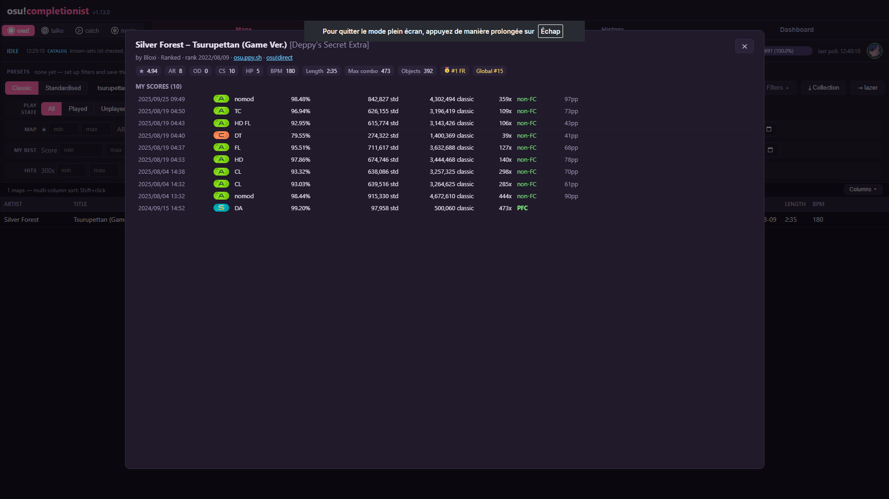
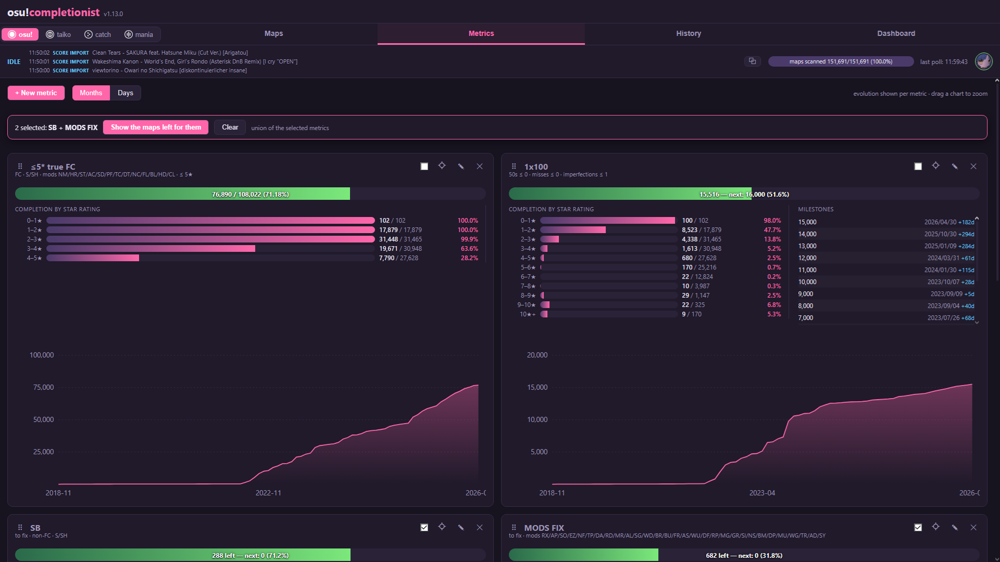
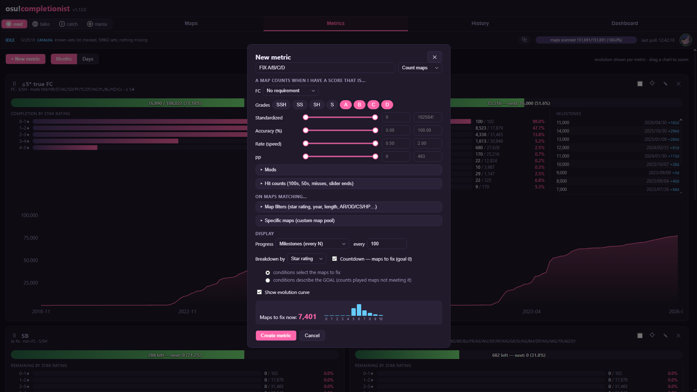
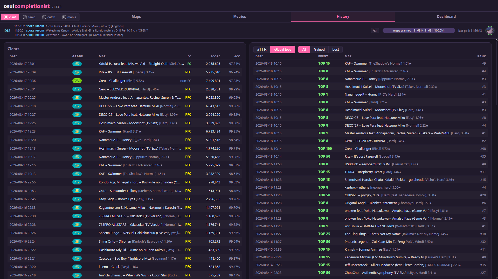
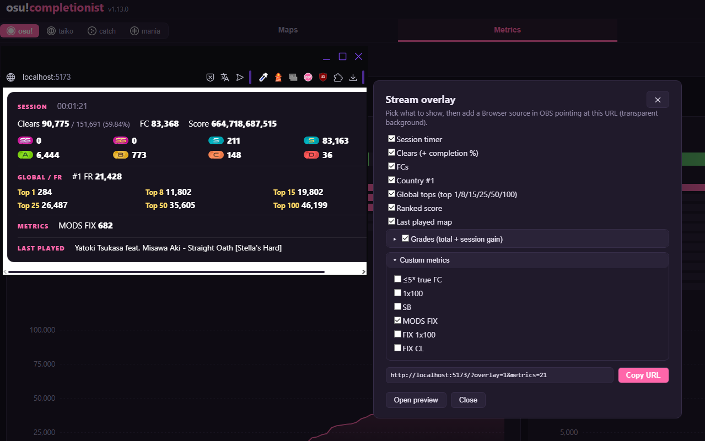

# osu! Completionist Tracker

Local desktop app that keeps your best score on every ranked, approved and loved difficulty of osu!, in all four modes, converts included. It gives you a sortable and filterable maps table, a completion dashboard, custom counters with milestones and charts, country #1 and global tops tracking and an OBS overlay. New scores show up a couple of minutes after you set them.



<details>
<summary>More screenshots: the rest of the dashboard, maps table, map details, custom metrics, metric builder, history, OBS overlay</summary>



















</details>

## Rulesets

The four modes work the same way: own catalog, score import, country #1 and
global tops sweeps, metrics, history, dashboard and overlay. Each one also
counts the **converts**, the osu! maps playable in it, and a selector switches
between all maps, its own maps or the converts only (mania adds 4K / 7K / other).

Enabling a mode in Settings only unlocks its views. Nothing hits the API until
you press its **Start initial sync**, and that first run takes days of polite
API budget: its own maps first, the converts behind. Starting a non-std mode
also reads the osu! catalog, since that is where its converts come from, but it
never fetches osu! scores.

Per-mode rules come from the ppy/osu source: hit results, FC semantics, classic
score formulas (mania's classic IS the standardised score), grade rules (mania
SS without 100% accuracy), key counts, and per-mode star ratings for the
converts you played.

## Features

- **Maps table**: your best on every difficulty in the game. Sorting and filters run in SQL (grade, FC state, star rating, AR/OD/CS/HP, length, ranked and played dates, mods, score, global rank, free text), with presets and virtualised rows. Right-click a row to open the map details: every score you set on it in a sortable table, with the rate and the mod multiplier.
- **Realistic missing score**: a skill curve built from your own bests (median per 0.1★, isotonic regression) predicts what *you* can score on a map, instead of its theoretical max.
- **Custom metrics**: your own counters, like "FCs with HD on 4★+ maps from 2015" or "global top 8s in 6★+". Each one has its own scope (the mode's own maps or its converts, mania key counts, ranked/approved/loved) and its own conditions, checked against each map's best score, the same rule leaderboards use. You get a progress bar, completion per bucket in the dimension you pick (star rating, year, length, combo, AR/OD/CS/HP), milestone dates and an evolution chart. Clears, Full combos and Ranked score come built in.
- **Country #1 tracking**: which of your scores are #1 on your country's leaderboard, gained/lost history with sniper names, automatic re-checks. (Requires osu!supporter + connecting your account.)
- **Global tops tracking**: your exact position on every played map's global leaderboard, with top 1/8/15/25/50/100 counters on the dashboard, a sortable column, a range filter and a metric condition. The sweep is resumable, every new best is checked right away, and held top 100s are re-checked periodically.
- **Discord notifications**: an optional webhook posts your new bests as embeds with the modded star rating, rate-adjusted map stats, hit counts, pp, cover art, your global rank when it is top 100, and the name of the player you sniped.
- **Dashboard**: completion by status/star rating/year, grade and FC distributions, skill curve, score sums (lazer / classic / optional [witherscore](https://github.com/ppy/osu/discussions/38224)).
- **History**: full clear log and country #1 event log.
- **Collection export**: turn any filter, a metric's missing maps included, into an osu! collection. Download the `.db`, or send it straight to osu!lazer in one click with [LazerCollectionImporter](https://github.com/ZaB0oo/LazerCollectionImporter) and `LAZER_IMPORTER_PATH`.
- **Heatmap and streaks**: a clears-per-day calendar with your current and record streaks. Click a day to see what you gained (clears, FCs, ranked score, grade changes) and the maps you played.
- **Time machine**: a slider that replays your account on any past day (clears, FCs, ranked score, country #1s), instantly and per mode.
- **Stream overlay**: browser source for OBS with live session gains.
- **Polite syncing**: 60 req/min max against the osu! API, resumable score import, daily catch-up of newly ranked/loved maps.

## Installation

Grab the installer for your OS from the **[latest release](https://github.com/ZaB0oo/tracker/releases/latest)**. No Node, no git, nothing else to install:

- **Windows**: `osu-completionist-Setup-x.y.z.exe` (one-click install)
- **macOS**: `osu-completionist-x.y.z-mac.dmg` (unsigned build: right-click → Open the first time)
- **Linux**: `osu-completionist-x.y.z.AppImage`

On first launch the app offers to **import an existing `tracker.db`**, which keeps everything: scores, catalog, metrics, settings, credentials. You can also start fresh. Then open **Settings** and fill in the **osu! OAuth** section: create an application at https://osu.ppy.sh/home/account/edit#oauth with the callback URL `http://localhost:3727/api/auth/callback`, paste the client id/secret and your user id. A step-by-step guide is built into the settings dialog.

Closing the window asks whether to keep the tracker running in the tray (polling, sweeps, Discord keep going) or to quit. Your answer can be remembered, and the tray menu changes it later. Data lives in your user profile (`%AppData%\osu-completionist` on Windows). Updates install themselves and offer a restart when they are ready; your database is never touched.

## Running from source (developers)

- **Node.js ≥ 22.13** (the DB uses `node:sqlite`, built into Node: no native compilation).

```bash
npm install
copy .env.example .env      # or fill the credentials later in the UI settings
npm run dev                 # API server (:3727) + UI (http://localhost:5173)
```

For a local production build on a single URL (http://localhost:3727): `npm run build && npm start`. On Windows, `start-tracker.bat` does it for you. The desktop shell itself: `npm run desktop` (dev) and `npm run dist:win` (build the installer locally). OAuth credentials from the UI are stored in the local DB and take priority over `.env`.

## First launch: initial sync

In the UI, click **"Start initial sync"** (or `curl -X POST http://localhost:3727/api/sync/start`). Three phases, all visible in the status bar:

1. **Catalog**: reads every ranked/approved/loved map from `/beatmapsets/search`. The search only returns ~10,000 results per query, so the app reads year by year and saves a cursor per year, which makes it resumable. Count 30 to 60 min.

   DMCA and delisted maps never show up in the search. Once the read is done, the app fetches them one by one from the list shipped in `server/db/seed-sets.json`, so a fresh install ends up with the full catalog on its own. That list says how many diffs each known set has in each mode (`{"v": 2, "sets": {"<set id>": <8 bits per mode>}}`), which is what lets it spend requests only on the modes you track and still notice a set that holds part of a mode's diffs. If something still looks off: `POST /api/sync/verify-year/<year>`, `POST /api/sync/import-set/<id>`, or the dump verification. Maintainers regenerate the list from a complete database with `npm run export-seed`.
2. **Map details**: `GET /beatmaps?ids[]=` by batches of 50 for max_combo (the FC reference and the combo filter), object counts (the classic score formula needs them) and the `.osu` MD5 checksum (used by the collection export). ~1 h for the whole game. It runs after the catalog is complete, so the map count on screen is already the final one while it works.
3. **Score import**: `GET /beatmaps/{id}/scores/users/{id}/all` for every diff. Resumable at any time: pause and resume in the UI, or just kill the process, only the unchecked maps are redone. Maps with no score are marked "never played".

While all this runs, **polling** is already active: every 2 min (configurable), your scores from the last 24 h are fetched at top priority.

## New ranked/loved maps

Automatic, three mechanisms:

1. **Daily delta**: ~once a day, a scan of `/beatmapsets/search` sorted by rank date stops as soon as a full page is already known. New diffs are enriched, then their scores are imported right away. Manual trigger: `POST /api/sync/delta-now`.
2. **Via polling**: if you play a map missing from the catalog, it is fetched at high priority and added along with your score.
3. **Status changes** (e.g. graveyard → loved) are picked up by the delta and by the "Full catalog re-scan" (Maintenance menu), which also refreshes star ratings and DMCA flags.

## Country #1 tracking

Connect your osu! account from the sync bar (**supporter required**, country leaderboards are a supporter feature). The app then:

- sweeps the country leaderboard of every played map (1 request/map, resumable).
- re-checks each new score immediately after you set it.
- re-checks held #1s periodically (default every 48 h, "Re-check #1 country (h)" in settings) to detect snipes, and logs gained/lost events with the sniper's name.

The country is whatever your osu! profile says.

## Global tops tracking

Start it from the sync menu, where one button toggles start and pause. The app then:

- sweeps every played map for your exact global leaderboard position (1 request/map, resumable, low priority, deferred while the score import runs; works without a connected account).
- checks the position of **every new best immediately**.
- re-checks held top-100 positions periodically (default every 48 h, "Re-check global tops (h)" in settings) to catch overtakes.

Positions are exact whatever their value (#4523 included); only the periodic re-checks are limited to held top-100s. To refresh everything else on demand, use "Re-check all global tops" in the Maintenance menu (re-queues every played map, resumable). Counters (top 1/8/15/25/50/100) appear on the dashboard once the sweep has run.

## Discord notifications

Paste a channel **webhook URL** in Settings and every new best gets posted as an embed: star rating with your mods, rate-adjusted BPM, length and map stats, hit counts, pp, mapset cover, your global rank when it is top 100, and the country #1 you took with the sniped player's name. First clears and improvements are batched per poll. A test button checks the setup. The URL stays in the local database, and sending never blocks the sync.

## Rate limiting (osu!api terms of use)

One global queue, 60 req/min at most, smoothed to one request per second. Polling comes before the score import, and 429 or 5xx answers back off exponentially (honoring `Retry-After`).

The score import runs on that same budget: roughly 150k maps at one request each, so about 42 h per mode. There is no shortcut. The API only gives your score on one beatmap at a time (`beatmaps/{id}/scores/users/{user}`), `users/{id}/scores/{type}` returns top-N lists, and the global `scores` feed cannot be filtered by user or beatmap and refuses old cursors. Scraping is not an option.

## Score model: what is stored and why

Every score is stored with **both systems** (modern `x-api-version` header):

- `total_score`: lazer standardised (~1M × mod multiplier + bonus).
- `classic_total_score`: lazer's "classic" display. Classic is a **monotone** transform of standardised on a given map, so best classic = best standardised (one best pointer for both).
- UI toggle "Classic / Standardised" (classic by default).
- Mod multipliers were rebalanced in **June 2026** and **every score recomputed server-side by osu!**, stable imports included: values returned by the API are already up to date. We never recompute a multiplier ourselves. Raw API payloads are kept (`raw`); `POST /api/sync/recompute` recomputes bests/FC states after a local logic change. **pp values are never recomputed locally**: they come from the API. After a pp rework, re-import every score to pick up the new values.

### FC states (FC column)

- **PFC**: perfect combo, from `legacy_perfect` for stable scores and `is_perfect_combo` for lazer, falling back to combo == map max_combo.
- **FC**: no miss and no break. For a **stable** no-miss score: dropping a slider end gives a 100 and removes exactly 1 combo, so FC iff `map_max_combo − score_combo ≤ number_of_100s`. Beyond that, certain slider break ⇒ non-FC. For a **lazer** no-miss score without `large_tick_miss`: FC.
- **non-FC**: `miss` > 0, `large_tick_miss` > 0, or missing combo unexplainable by slider ends (rule above).

### Grades

D → SSH, with **silvers** (SH/SSH = HD/FL) counted separately. The API returns X/XH, the UI displays SS/SSH.

## Missing score: a documented approximation

- The **Missing** column depends on the display mode:
  - **Classic**: official lazer formula `classic = (n_objects² × 32.57 + 100000) × standardised / 1,000,000` (n_objects = circles + sliders + spinners) → theoretical max per map = `n_objects² × 32.57 + 100000`. Missing = skill-curve prediction minus your best, floored at 0.
  - **Standardised**: same, in standardised units. Spinner bonus ignored (< 0.1%).
  - Unplayed map = full prediction missing. The displayed % is relative to the map's prediction.
- **Witherscore** (optional, settings): implements the community proposal [ppy/osu#38224](https://github.com/ppy/osu/discussions/38224) as an alternative ranked-score display.

## Project structure

```
server/
  config.ts            # .env, API constants
  db/schema.sql        # beatmapsets, beatmaps, scores, beatmap_user, metrics, sync_state
  db/db.ts             # node:sqlite + migrations + transactions
  osu/rateLimiter.ts   # 60/min queue with 2 priorities + backoff (tested)
  osu/api.ts           # OAuth (client credentials + user auth code) + typed endpoints
  logic/score.ts       # FC states / grades / bests (tested)
  logic/scoreSql.ts    # shared SQL expressions + skill curve
  logic/metrics.ts     # custom metric conditions compiled to SQL
  logic/metricEval.ts  # metric evaluation + versioned cache
  logic/repo.ts        # score upserts + best pointers
  sync/catalog.ts      # API catalog enumeration + enrichment
  sync/daemon.ts       # pipeline, resumable score import, polling, country/global sweeps
  notify/discord.ts    # webhook notifications (rich embeds, queue, retry)
  routes.ts            # router aggregator
  routes/*.ts          # one module per domain (table, stats, metrics, sync…)
web/                   # React + Vite + TanStack Query/Table/Virtual
desktop/               # Electron shell: tray, first-launch DB import, auto-update
.github/workflows/     # release CI: installers built on every version tag
```

Database: `./data/tracker.db` in source mode, `%AppData%\osu-completionist\data\tracker.db` in the desktop app (SQLite, WAL mode; tray menu → "Open the data folder"). Delete the file to start from scratch. One-click backup: settings menu → "Export database". That file holds your API keys, your osu! token and your Discord webhook, so keep it to yourself.

## Tests

```bash
npm test    # rate limiter, FC and best logic, mods, metrics, search
```

## Known limits

- Legacy (ScoreV1) max score is not computed: it depends on map geometry, which would mean parsing `.osu` files.
- Polling only sees the **last 24 hours** (limit of the `recent` endpoint) and ignores fails. If the app was off longer while you played, use "Poll now", and a full score re-import if needed.
- Country leaderboards require **osu!supporter**; without a connected account, country #1 features stay dormant.
- The initial global tops sweep spends one request per played map on the shared 60 req/min budget, so it takes about a day on a full account; positions outside the held top-100s only refresh when you set a new best on the map or via "Re-check all global tops" in the Maintenance menu.
- `node:sqlite` prints an `ExperimentalWarning` at startup: harmless.
- A mode's dashboard needs two days of history before its time machine has anything to show.

## Credits

This project was entirely coded by AI, [Claude](https://claude.com) (Anthropic), directed and tested by [ZaBoo](https://osu.ppy.sh/users/13344661). Mode icons come from [osu-resources](https://github.com/ppy/osu-resources) (ppy). Every feature, fix and design decision was specified, reviewed and checked against a real completionist database.

